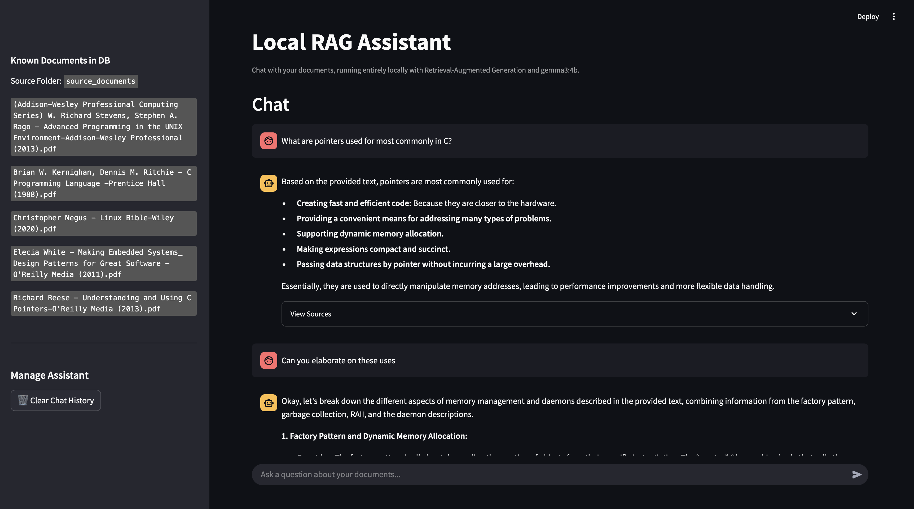

# Local Ollama RAG Assistant

A fully local AI chatbot with a web-based interface, powered by **Retrieval-Augmented Generation (RAG)** and **Ollama**. This assistant runs completely offline and can answer your questions based on the documents you upload — including PDFs, Word files, images (OCR), and more.

---

## Features

- 🔒 100% local and private — no cloud or API calls
- 🧠 RAG pipeline using LangChain + Chroma + Hugging Face embeddings
- 🗂️ Supports multiple file types: PDF, Word, images (OCR), and plain text
- 💬 ChatGPT-style web interface built with Streamlit
- 📚 Shows sources used for each answer
- 🕓 Saves chat history locally

---

## Tech Stack

- [Ollama](https://ollama.com/) (LLM backend, e.g., `gemma3:4b`)
- [LangChain](https://www.langchain.com/) (RAG framework)
- [Chroma](https://www.trychroma.com/) (persistent vector DB)
- [HuggingFace Embeddings](https://huggingface.co/sentence-transformers/all-MiniLM-L6-v2)
- [Streamlit](https://streamlit.io/) (frontend UI)

---

## User Interface



---

## Getting Started

### 1. Clone the Repository

```bash
git clone https://github.com/your-username/local-ollama-rag-assistant.git
cd local-ollama-rag-assistant
```

### 2. Create & Activate Virtual Environment

```bash
# Create virtual environment
python -m venv .venv

# Activate (Mac/Linux)
source .venv/bin/activate

# Activate (Windows)
.venv\Scripts\activate
```

### 3. Install Dependencies

```bash
pip install -r requirements.txt
```

### 4. Run the Application

```bash
streamlit run app.py
```

---

## File Structure (Simplified)

```bash
.
├── source_documents       # Folder for files to run RAG on
├── app.py                 # Streamlit UI/App
├── rag_engine.py          # Core RAG logic
├── doc_loader.py          # File ingestion + parsing
├── chat_history.json      # Chat history file
├── requirements.txt       # Python dependencies
└── README.md              # You're here!
```

---

## Requirements

- Python 3.9+
- Ollama installed and running locally (`gemma3:4b` or any model)
- Tesseract (for image OCR) — install via:
  ```bash
  brew install tesseract      # macOS
  sudo apt install tesseract  # Linux
  ```

---

## Notes

- Files in `source_documents` folder are processed into vector embeddings using `all-MiniLM-L6-v2`.
- You can customize chunk size, overlap, and other parameters in `rag_engine.py`.
- Chat history is saved in a local file (`chat_history.json`) by default.

---

## Contributing

Pull requests welcome! If you’d like to add support for more file types, model switching, or a better UI — feel free to fork and open a PR.

---

## License

MIT License. Use freely and privately.

---

## Acknowledgments

- [LangChain](https://www.langchain.com/)
- [Ollama](https://ollama.com/)
- [Chroma](https://www.trychroma.com/)
- [HuggingFace Transformers](https://huggingface.co/)
